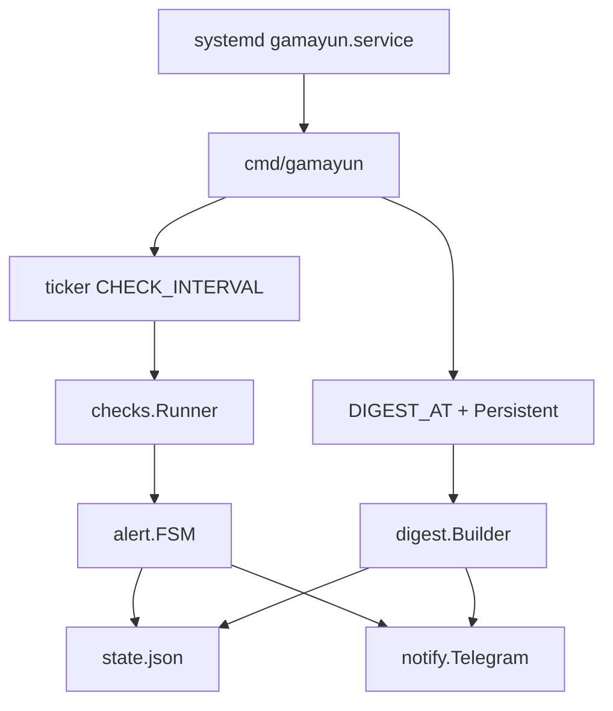

# Архитектура Gamayun

Долгоживущий процесс. systemd поднимает его как `Type=simple` с `Restart=always`. Таймер не используется: и проверки, и ежедневная сводка живут внутри демона.



## Пакеты

```
cmd/gamayun     точка входа, флаги, сигналы
internal/config         YAML /etc/gamayun/config.yaml и дефолты
internal/checks         интерфейс Check, все пробы
internal/alert          FSM PROBLEM / REMIND / RECOVERED
internal/digest         текст сводки, отбор инцидентов
internal/notify         Telegram sendMessage
internal/state          атомарная запись state.json
internal/service        цикл демона
```

Конфиг: YAML `/etc/gamayun/config.yaml` (секции `telegram`, `checks`, `alerts`, `digest`, `paths`). Пример — `configs/config.example.yaml`. `TG_BOT_TOKEN` / `TG_CHAT_ID` в окружении перекрывают файл.

Зависимости: стандартная библиотека + `gopkg.in/yaml.v3`. Сертификаты — `crypto/x509`. Docker — CLI, не SDK. Порты — `/proc/net/tcp{,6}`, не `ss`.

## Цикл демона

1. Старт: загрузить конфиг и `state.json`. Если слот сводки уже прошёл, а `last_digest` старше слота — отправить сводку (Persistent). Первый запуск без `last_digest`: сводка только если уже наступило сегодняшнее `DIGEST_AT`, иначе ждём.
2. Сразу прогон проверок, затем по тикеру.
3. Каждый тик: `Runner` → FSM → сохранить state. Затем проверка «нужна ли сводка».
4. SIGINT / SIGTERM — выход без частичной записи (save после полного тика).

`--once` только печатает результаты и код выхода, без Telegram и без state. `--digest` собирает свежий снапшот, шлёт сводку, обновляет `last_digest`. `--test` шлёт одну строку и выходит. `--version` и `--update` не требуют конфиг: апдейт качает latest GitHub Release, сверяет SHA256 и подменяет бинарник (если пакет из apt — просит `apt upgrade`). Подробности: [PACKAGING.md](PACKAGING.md).

## Интерфейс проверки

```go
type Result struct {
    Key     string            // "disk.root", "nginx.active"
    OK      bool
    Message string
    Metrics map[string]string // для дайджеста
    Skip    bool              // нет nginx/docker — не алертить
}
```

Одна реализация может вернуть несколько `Result` (сертификаты, docker). `Skip` не открывает инцидент и не попадает в «красные» строки сводки.

## Alert FSM

Ключ состояния — `Result.Key`. Память процесса плюс `/var/lib/gamayun/state.json` (рестарт не сбрасывает эскалацию и открытые инциденты).

Антифлап: FAIL учитывается только после `FAIL_STREAK` подряд (дефолт 2 ≈ 2 минуты при интервале 60 с). Пока стрик не набран, в Telegram тишина.

Подтверждённое падение:

1. `PROBLEM from {SERVER_NAME}` + текст, открыть инцидент, `next_remind = now + 5m`.
2. Пока FAIL и `now >= next_remind`: `REMIND #n`, интервалы из `ESCALATION` (5m, 30m, 2h, дальше каждый 2h).
3. `RECOVER_STREAK` OK подряд (дефолт 1): `RECOVERED`, закрыть инцидент, сбросить level и стрик.

Смена текста той же проверки (другой unhealthy-контейнер) не начинает новый PROBLEM: новый текст уйдёт в следующее напоминание. Открытый инцидент обновляет `last_message`.

Часы и нотификатор внедряются в FSM — юнит-тесты крутят виртуальное время без сети.

## state.json

```json
{
  "checks": {
    "disk.root": {
      "status": "firing",
      "fail_streak": 2,
      "ok_streak": 0,
      "first_seen": "2026-08-30T10:12:00+03:00",
      "last_alert": "2026-08-30T10:12:00+03:00",
      "next_remind": "2026-08-30T10:17:00+03:00",
      "alert_count": 1,
      "last_message": "disk /: 91% used (>=85%)"
    }
  },
  "incidents": [
    {
      "check": "disk.root",
      "started": "2026-08-30T10:12:00+03:00",
      "resolved": null,
      "reminders": 0,
      "last_message": "disk /: 91% used (>=85%)"
    }
  ],
  "last_digest": "2026-08-30T08:00:05+03:00"
}
```

Запись: temp-файл в том же каталоге + `rename`. Инциденты старше 7 дней (уже закрытые) вычищаются после успешной сводки. Открытые не трогаем.

## Ежедневная сводка

Время — локальная зона машины. Слот: сегодня в `DIGEST_AT`, если `now` ещё раньше — вчерашний слот.

Отправляем, если `last_digest` строго раньше последнего наступившего слота. Пустой `last_digest`: только если уже наступило сегодняшнее `DIGEST_AT` (установка в 10:00 даст сводку сразу; установка в 07:00 — в 08:00).

Текст:

1. `{SERVER_NAME} daily {YYYY-MM-DD}`
2. Snapshot: диск, RAM, load15, nginx, порты, дни сертификатов, docker (и Skip-строки как `skipped`).
3. Incidents с момента `last_digest` (если его нет — за 24 ч): start, end или `OPEN`, число напоминаний, последний текст.
4. Если инцидентов нет: `Incidents: none`.

После успешной отправки: `last_digest = now`, prune.

## systemd

Файл unit: `deploy/gamayun.service`.

```ini
[Service]
Type=simple
ExecStart=/usr/local/bin/gamayun --config /etc/gamayun/config.yaml
Restart=always
RestartSec=5
```

Конфиг только из YAML (`--config`). Процесс root: нужны docker, systemctl, `/etc/letsencrypt`.

## Безопасность

- `/etc/gamayun/config.yaml` — `0600`, токен не пишется в журнал.
- Таймаут Telegram 20 с.
- Нет входящего HTTP. Исходящий только `api.telegram.org`.
