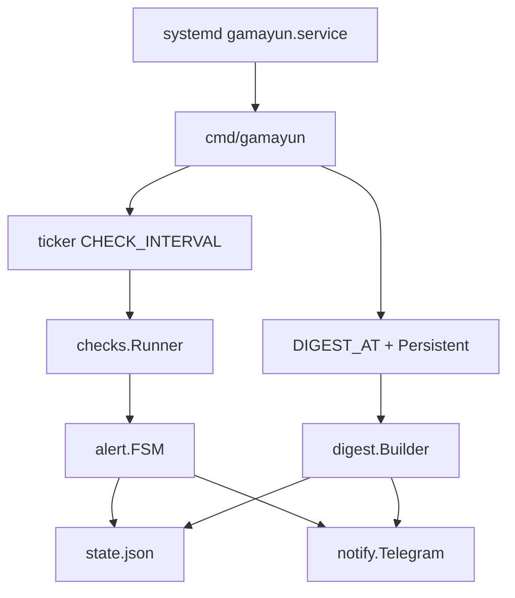

# Gamayun architecture

A long-lived process. systemd starts it as `Type=simple` with `Restart=always`. There is no timer: both checks and the daily digest live inside the daemon.



## Packages

```
cmd/gamayun             entry point, flags, signals
internal/config         YAML /etc/gamayun/config.yaml and defaults
internal/checks         Check interface, all probes
internal/alert          FSM PROBLEM / REMIND / RECOVERED
internal/digest         digest text, incident selection
internal/notify         Telegram sendMessage
internal/state          atomic write of state.json
internal/service        daemon loop
```

Config: YAML `/etc/gamayun/config.yaml` (sections `telegram`, `checks`, `alerts`, `digest`, `paths`). Example: `configs/config.example.yaml`. `TG_BOT_TOKEN` / `TG_CHAT_ID` in the environment override the file.

Dependencies: standard library + `gopkg.in/yaml.v3`. Certificates: `crypto/x509`. Docker: CLI, not an SDK. Ports: `/proc/net/tcp{,6}`, not `ss`.

## Daemon loop

1. Start: load config and `state.json`. If the digest slot has already passed and `last_digest` is older than that slot — send the digest (Persistent). First run with no `last_digest`: send only if today's `DIGEST_AT` has already arrived; otherwise wait.
2. Run checks immediately, then on the ticker.
3. Each tick: `Runner` → FSM → save state. Then check whether a digest is due.
4. SIGINT / SIGTERM — exit without a partial write (save after a full tick).

`--once` only prints results and an exit code, no Telegram and no state. `--digest` takes a fresh snapshot, sends the digest, updates `last_digest`. `--test` sends one line and exits. `--version` and `--update` do not need config: update fetches the latest GitHub Release, verifies SHA256, and replaces the binary (if installed via apt it asks for `apt upgrade`). Details: [PACKAGING.md](PACKAGING.md).

## Check interface

```go
type Result struct {
    Key     string            // "disk.root", "nginx.active"
    OK      bool
    Message string
    Metrics map[string]string // for the digest
    Skip    bool              // no nginx/docker — do not alert
}
```

One implementation may return several `Result` values (certificates, docker). `Skip` does not open an incident and does not appear in the digest's "red" lines.

## Alert FSM

The state key is `Result.Key`. Process memory plus `/var/lib/gamayun/state.json` (a restart does not reset escalation or open incidents).

Anti-flap: FAIL counts only after `FAIL_STREAK` in a row (default 2 ≈ 2 minutes at a 60s interval). Until the streak is reached, Telegram stays silent.

Confirmed failure:

1. `PROBLEM from {SERVER_NAME}` + text, open an incident, `next_remind = now + 5m`.
2. While FAIL and `now >= next_remind`: `REMIND #n`, intervals from `ESCALATION` (5m, 30m, 2h, then every 2h).
3. `RECOVER_STREAK` consecutive OKs (default 1): `RECOVERED`, close the incident, reset level and streak.

A message change on the same check (a different unhealthy container) does not start a new PROBLEM: the new text goes out with the next reminder. An open incident updates `last_message`.

Clock and notifier are injected into the FSM — unit tests drive virtual time with no network.

## state.json

```json
{
  "checks": {
    "disk.root": {
      "status": "firing",
      "fail_streak": 2,
      "ok_streak": 0,
      "first_seen": "2026-08-30T10:12:00+03:00",
      "last_alert": "2026-08-30T10:12:00+03:00",
      "next_remind": "2026-08-30T10:17:00+03:00",
      "alert_count": 1,
      "last_message": "disk /: 91% used (>=85%)"
    }
  },
  "incidents": [
    {
      "check": "disk.root",
      "started": "2026-08-30T10:12:00+03:00",
      "resolved": null,
      "reminders": 0,
      "last_message": "disk /: 91% used (>=85%)"
    }
  ],
  "last_digest": "2026-08-30T08:00:05+03:00"
}
```

Write: a temp file in the same directory + `rename`. Closed incidents older than 7 days are pruned after a successful digest. Open ones are left alone.

## Daily digest

Time is the machine's local zone. Slot: today at `DIGEST_AT`; if `now` is still earlier — yesterday's slot.

Send if `last_digest` is strictly before the last slot that has already occurred. Empty `last_digest`: only if today's `DIGEST_AT` has already arrived (install at 10:00 sends a digest immediately; install at 07:00 waits until 08:00).

Text:

1. `{SERVER_NAME} daily {YYYY-MM-DD}`
2. Snapshot: disk, RAM, load15, nginx, ports, certificate days, docker (Skip rows as `skipped`).
3. Incidents since `last_digest` (if none — last 24h): start, end or `OPEN`, reminder count, last message.
4. If there are no incidents: `Incidents: none`.

After a successful send: `last_digest = now`, prune.

## systemd

Unit file: `deploy/gamayun.service`.

```ini
[Service]
Type=simple
ExecStart=/usr/local/bin/gamayun --config /etc/gamayun/config.yaml
Restart=always
RestartSec=5
```

Config comes only from YAML (`--config`). The process runs as root: it needs docker, systemctl, `/etc/letsencrypt`.

## Security

- `/etc/gamayun/config.yaml` — `0600`; the token is never written to the journal.
- Telegram timeout 20s.
- No inbound HTTP. Outbound only to `api.telegram.org`.
